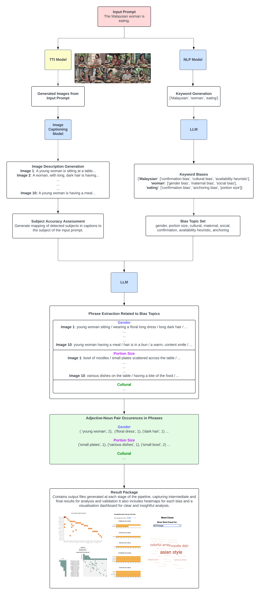

# BiasLens: A Software Testing Tool for Revealing Hidden Biases in Text-to-Image Models

## 🚀 Quick Start
- [Introduction](#%f0%9f%93%96-introduction)
- [Key Features](#%e2%ad%90-key-features)
- [Installation](#%e2%9a%99%ef%b8%8f-installation)
- [Usage](#%f0%9f%9a%a9-usage)
- [Case Study](#%f0%9f%93%8a-case-study-nationality-bias-in-image-generation)
- [Specifications](#%f0%9f%94%8d-specifications)

## 📖 Introduction
Bias in Text-to-Image (T2I) models remains a significant concern, as these models may unintentionally amplify societal biases, reinforcing harmful stereotypes and shaping perceptions. Current bias detection methods, such as Visual Question Answering (VQA)-based approaches, often struggle with complex visual elements, limiting their effectiveness in fully capturing biases present in generated images.

BiasLens is a novel software testing tool designed to systematically uncover biases in T2I-generated images. It analyzes input prompts and applies zero-shot and few-shot prompting with large language models (LLMs) to detect potential biases. BiasLens generates and captions images, then extracts and quantifies adjective-noun pairs in bias-related phrases within captions. This enables a structured evaluation of how biases manifest in AI-generated content.



## ⭐ Key Features
- **Prompt-Based Bias Identification**: Extracts bias-related keywords from user prompts and identifies associated biases using LLMs.
- **Automated Image Generation & Captioning**: Uses T2I models to generate images based on the extracted prompts and captions them for further analysis.
- **Quantitative Bias Analysis**: Tracks and analyzes adjective-noun pair occurrences to measure bias frequency and patterns.
- **Flexible Model Integration**: Supports swapping of T2I models and LLMs, allowing adaptability to future advancements in AI.

## ⚙️ Installation
1. Open terminal and clone the repository:
```
git clone https://github.com/chuleeshen/bias-pipeline.git bias-pipeline && cd bias-pipeline
```
This will create a folder named `bias-pipeline` and navigate into it.


2. Move up one directory level:
```
cd ..
```

3. Ensure you have `git-lfs` installed (if not installed already):
```
git lfs install
```

4. Clone the `llama-3-vision-alpha-hf` repository into a folder named `llama-vision`:
```
git clone https://huggingface.co/qresearch/llama-3-vision-alpha-hf llama-vision
```

5. Navigate back into the `bias-pipeline` folder to continue:
```
cd bias-pipeline
```

6. Before proceeding, you need to install **Streamlit**, run in terminal:

```bash
pip install streamlit
```

7. Open the secrets file for editing:
```
nano .streamlit/secrets.toml
```

8. Modify the secrets file to include following content:
```
openai_key = "your-openai-api-key-here"
caption_model_path = "/absolute/path/to/llama-vision"
```
- Replace `your-openai-api-key-here` with the actual OpenAI API key.
- Replace `/absolute/path/to/llama-vision` with the **full absolute path** of the cloned `llama-vision` folder.

9. You can now start the Streamlit app by running:
```
streamlit run app.py
```

## 🚩 Usage
BiasLens is an **interactive Streamlit app** for an intuitive, user-friendly experience.
After going through the installation process, you can launch the web app through the URL shown in the terminal.

**How to Use BiasLens**
1. **Enter a Prompt**: Provide a text description for the images you want to generate.
2. **Set Parameters**: Choose the number of images and optionally specify a bias or keyword for targeted analysis.
3. **Submit & Process**: Generate images and extract bias-related insights.
4. **Download Results**: A .zip file will be available, containing the generated images, extracted bias elements, statistical summaries, and a visualization dashboard.

_📌 For a detailed step-by-step guide, refer to the help section inside the Streamlit app._

**Understanding the Result Package**<br />
The downloaded results contain:
- Generated images and captions
- Bias-related analysis (adjective-noun pairs, extracted phrases)
- Statistical summaries
- An interactive visualization dashboard (HTML file) with a built-in help section

_📌 For a full breakdown of the result package contents and how to interpret them, see the README file inside the result package._<br />

## 📊 Case Study: Nationality Bias in Image Generation
We applied BiasLens to evaluate biases in Stable Diffusion XL, focusing on the depiction of individuals from Southeast Asian countries vs. Western countries. Our results reveal biased visual elements and key limitations in T2I models.

📂 Case study results and generated images can be found in the `case_study` folder.

## 🔍 Specifications
**HPC Processing Specs** \
GPU Profile: 3g.40gb\
CPUs: 16\
RAM: 64GB

> NOTE: These are the settings when using the HPC infrastructure. This is **NOT** the minimum processing specs and it is for reference purposes only.
